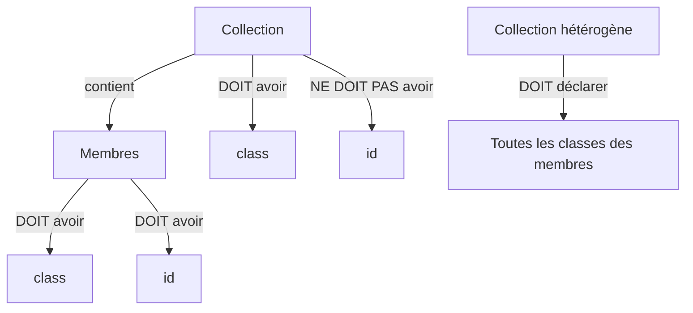

# Spécification EWLP (Extended Web Linking Protocol)

## 1. Introduction

Dans une architecture REST, une même ressource peut être identifiée par différentes URIs, chacune représentant une perspective particulière de cette ressource. Cette multiplicité des identifiants crée une ambiguïté pour les clients qui doivent déterminer si différentes URIs identifient la même ressource.

EWLP résout cette ambiguïté en étendant le protocole Web Linking (RFC 8288) avec les attributs `class` et `id`. La combinaison de ces attributs fournit un identifiant stable de la ressource, indépendant des URIs qui deviennent alors des identifiants contextuels.

## 2. Définitions

### Ressource

Une entité identifiable accessible via une ou plusieurs URIs. Une ressource peut être soit un membre, soit une collection.

### Membre

Une ressource individuelle représentant une entité unique (ex: un article spécifique, un commentaire).

### Collection

Un ensemble de ressources membres partageant une ou plusieurs classes communes.

## 3. Contraintes

1. Tous les liens vers une ressource DOIVENT inclure un attribut `class`
2. Les liens vers une collection NE DOIVENT PAS inclure d'attribut `id`
3. Les liens vers un membre DOIVENT inclure un attribut `id`
4. Les attributs `class` et `id` NE DOIVENT PAS contenir de valeur vide ni d'espaces en début ou fin de valeur
5. Une collection contenant des membres de classes différentes DOIT déclarer toutes ces classes dans son attribut `class`, séparées par des espaces

## 4. Exemples

### 4.1 Collection homogène

```http
Link: </articles>; rel="collection"; class="article"; title="Articles"
```

### 4.2 Collection hétérogène

```http
Link: </feed>; rel="collection"; class="article comment"; title="Fil d'actualité",
      </feed/1>; rel="item"; class="article"; id="42"; title="Article #42",
      </feed/2>; rel="item"; class="comment"; id="17"; title="Commentaire #17"
```

### 4.3 Membre

```http
Link: </articles/42>; rel="canonical"; class="article"; id="42"; title="Mon Article"
```

## 5. Cas invalides

### 5.1 Collection avec id

```http
Link: </articles>; rel="collection"; class="article"; id="main"  # Invalide : une collection ne doit pas avoir d'id
```

### 5.2 Membre sans id

```http
Link: </articles/42>; rel="item"; class="article"  # Invalide : un membre doit avoir un id
```

### 5.3 Espaces invalides dans les valeurs

```http
Link: </resource>; class=" article"; id="42"    # Invalide : espace au début de class
Link: </resource>; class="article "; id="42"    # Invalide : espace à la fin de class
Link: </resource>; class="article"; id=" 42"    # Invalide : espace au début de id
Link: </resource>; class="article"; id="42 "    # Invalide : espace à la fin de id
```

### 5.4 Collection hétérogène mal définie

```http
Link: </feed>; rel="collection"; class="article"; title="Feed",  # Invalide : la collection ne déclare pas toutes les classes de ses membres
      </feed/1>; rel="item"; class="article"; id="42",
      </feed/2>; rel="item"; class="comment"; id="17"
```

## 6. Diagramme des relations



## 7. Exemple complet d'interaction

### Requête

```http
GET /feed HTTP/1.1
Accept: application/json
```

### Réponse

```http
HTTP/1.1 200 OK
Content-Type: application/json
Link: </feed>; rel="self"; class="article comment"; title="Fil d'actualité",
      </feed?page=2>; rel="next"; class="article comment"; title="Page suivante",
      </articles/42>; rel="item"; class="article"; id="42"; title="Article #42",
      </comments/17>; rel="item"; class="comment"; id="17"; title="Commentaire #17"

[
  {
    "id": "42",
    "type": "article",
    "title": "Mon article"
  },
  {
    "id": "17",
    "type": "comment",
    "content": "Mon commentaire"
  }
]
```
